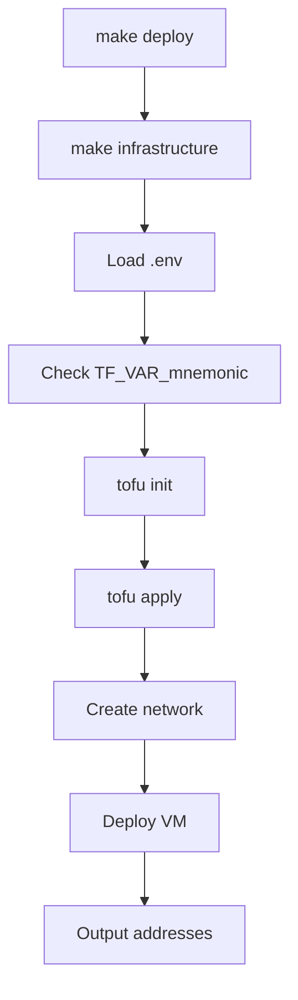
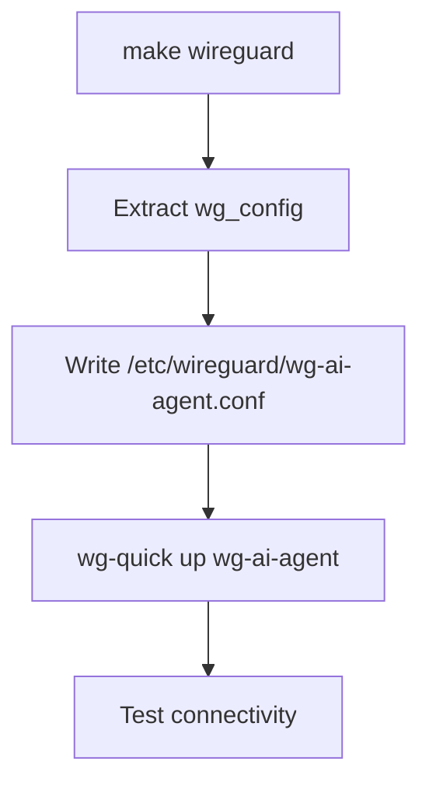
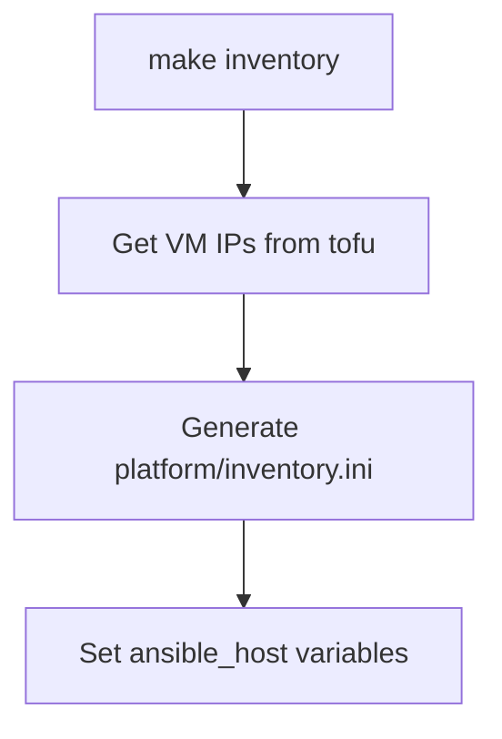
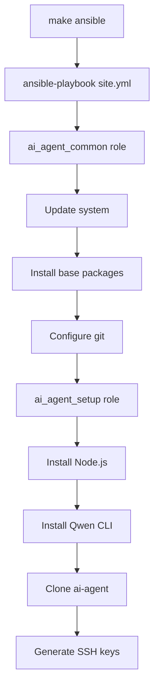

# Architecture Documentation

Complete architectural overview of TFGrid AI-Agent.

## Table of Contents
- [System Overview](#system-overview)
- [Component Architecture](#component-architecture)
- [Network Architecture](#network-architecture)
- [Deployment Flow](#deployment-flow)
- [Data Flow](#data-flow)
- [Security Architecture](#security-architecture)

## System Overview

TFGrid AI-Agent is a distributed system that combines infrastructure provisioning, configuration management, and AI-powered automation.

```
┌────────────────────────────────────────────────────────────┐
│                      Local Machine                         │
│  ┌──────────────┐  ┌──────────────┐  ┌─────────────────┐   │
│  │  OpenTofu    │  │   Ansible    │  │    Makefile     │   │
│  │  (IaC)       │  │   (Config)   │  │   (Interface)   │   │
│  └──────┬───────┘  └──────┬───────┘  └────────┬────────┘   │
│         │                 │                   │            │
│         │                 │                   │            │
└─────────┼─────────────────┼───────────────────┼────────────┘
          │                 │                   │
          │ WireGuard VPN   │                   │
          ▼                 ▼                   ▼
┌────────────────────────────────────────────────────────────┐
│                    ThreeFold Grid                          │
│  ┌───────────────────────────────────────────────────────┐ │
│  │                    AI agent VM                           │ │
│  │  ┌──────────────┐  ┌──────────────┐  ┌────────────┐ │ │ │
│  │  │  Node.js     │  │  ai-agent  │  │   Qwen     │ │ │ │
│  │  │  npm         │  │  framework   │  │   CLI      │ │ │ │
│  │  └──────────────┘  └──────────────┘  └────────────┘ │ │ │
│  │  ┌──────────────────────────────────────────────────┐ │ │
│  │  │         Project Workspace                        │ │ │
│  │  │  /opt/ai-agent-projects/                            │ │ │
│  │  │    ├── project1/                                 │ │ │
│  │  │    ├── project2/                                 │ │ │
│  │  │    └── project3/                                 │ │ │
│  │  └──────────────────────────────────────────────────┘ │ │
│  └───────────────────────────────────────────────────────┘ │
└────────────────────────────────────────────────────────────┘
```

## Component Architecture

### 1. Infrastructure Layer

**Technology**: OpenTofu/Terraform  
**Purpose**: VM provisioning on ThreeFold Grid  
**Location**: `infrastructure/`

```
infrastructure/
├── main.tf                  # Terraform configuration
└── credentials.auto.tfvars  # Node configuration (gitignored)

Resources Created:
- grid_network: VPN network with WireGuard + Mycelium
- grid_deployment: AI agent VM with specified resources
- random_bytes: Keys for Mycelium network
```

**Key Features**:
- Declarative infrastructure as code
- Idempotent deployments
- State management
- Output values for automation

### 2. Configuration Layer

**Technology**: Ansible  
**Purpose**: VM configuration and software installation  
**Location**: `platform/`

```
platform/
├── site.yml              # Main playbook
├── inventory.ini         # Generated inventory
├── requirements.yml      # Dependencies
├── group_vars/
│   └── all.yml          # Global variables
└── roles/
    ├── ai_agent_common/    # Base system setup
    │   └── tasks/
    │       └── main.yml
    └── ai_agent_setup/  # AI agent-specific setup
        └── tasks/
            └── main.yml
```

**Roles**:

**ai_agent_common**:
- System updates
- Base packages (git, curl, build-essential)
- Git configuration
- Firewall setup
- Workspace creation

**ai_agent_setup**:
- Node.js installation
- npm packages
- Qwen CLI installation
- ai-agent repository cloning
- SSH key generation for git
- API key configuration (if provided)

### 3. Control Layer

**Technology**: Bash scripts + Makefile  
**Purpose**: Unified interface and automation  
**Location**: `scripts/` + `Makefile`

```
scripts/
├── infrastructure.sh         # Deploy VM
├── wg.sh                    # Setup WireGuard
├── generate_inventory.sh    # Create inventory
├── address.sh               # Show addresses
├── connect.sh               # SSH to VM
├── ping.sh                  # Test connectivity
├── clean.sh                 # Destroy infrastructure
├── verify.sh                # Verify deployment
├── qwen-login.sh           # Qwen authentication
├── agent-create-project.sh  # Create project
├── agent-run-project.sh     # Start AI agent
├── agent-monitor-project.sh # Monitor progress
├── agent-stop-project.sh    # Stop AI agent
├── agent-list-projects.sh   # List projects
└── agent-git-setup.sh       # Git remote setup
```

**Script Pattern**:
```bash
#!/bin/bash
set -e

# 1. Check prerequisites
# 2. Get VM IP from OpenTofu
# 3. Execute operation (local or via SSH)
# 4. Provide feedback and next steps
```

### 4. Execution Layer

**Technology**: ai-agent framework  
**Purpose**: AI-powered continuous coding  
**Location**: `/opt/ai-agent` on VM

```
/opt/ai-agent/
├── Makefile              # agent operations
├── scripts/              # AI agent scripts
│   ├── create-project.sh
│   ├── run-project.sh
│   ├── monitor-project.sh
│   └── stop-project.sh
└── templates/            # Project templates
```

**Project Structure** (on VM):
```
/opt/ai-agent-projects/<project-name>/
├── .agent/              # AI agent metadata
├── .git/               # Git repository
├── prompt.md           # AI instructions
├── agent-output.log    # Execution log
├── agent-errors.log    # Error log
└── <project files>     # Generated code
```

## Network Architecture

### Layer 1: WireGuard VPN

**Purpose**: Secure encrypted connection from local machine to VM  
**IP Range**: `10.1.0.0/16`  
**Protocol**: UDP

```
Local Machine                    AI agent VM
    wg-ai-agent                     wg0
    10.1.0.1                     10.1.0.2
       │                            │
       └────── Encrypted Tunnel ───┘
```

**Features**:
- Modern cryptography (Curve25519, ChaCha20, Poly1305)
- Low overhead
- Fast handshake
- NAT traversal

### Layer 2: Mycelium Overlay

**Purpose**: End-to-end encrypted IPv6 overlay network  
**Protocol**: IPv6  
**Network**: Decentralized mesh

```
AI agent VM ──────── Mycelium Network ──────── Other TFGrid VMs
  IPv6                (Encrypted)              IPv6
```

**Features**:
- Global IPv6 addresses
- Automatic routing
- Self-healing mesh
- No central authority

### Network Modes

**Development Mode**:
```
Developer ──SSH/WireGuard──▶ AI agent VM
                             (Internal only)
```

**Production Mode** (optional):
```
Internet ──Public IP──▶ Gateway ──WireGuard──▶ AI agent VM
                         (NAT)                  (Internal)
```

## Deployment Flow

### Phase 1: Infrastructure Deployment



**Steps**:
1. Load configuration from `.env`
2. Verify mnemonic is set
3. Initialize OpenTofu
4. Create grid_network with WireGuard + Mycelium
5. Deploy grid_deployment with AI agent VM
6. Output WireGuard config and VM IPs

**Outputs**:
- `ai_agent_wg_ip`: WireGuard IP (e.g., 10.1.0.2)
- `ai_agent_mycelium_ip`: Mycelium IPv6
- `ai_agent_node_id`: Node where VM is deployed
- `wg_config`: WireGuard configuration

### Phase 2: Network Setup



**Steps**:
1. Extract WireGuard config from OpenTofu output
2. Write configuration to `/etc/wireguard/wg-ai-agent.conf`
3. Start WireGuard interface
4. Verify connectivity via ping

### Phase 3: Inventory Generation



**Generated Inventory**:
```ini
[ai_agent]
ai_agent_vm ansible_host=10.1.0.2

[ai_agent:vars]
ai_agent_mycelium_ip=<ipv6>
ai_agent_node_id=1234

[all:vars]
ansible_user=root
ansible_ssh_common_args=-o StrictHostKeyChecking=no
```

### Phase 4: Configuration



**Steps**:
1. Run `ai_agent_common` role:
   - Update apt cache
   - Install base packages
   - Configure git identity
   - Setup firewall
2. Run `ai_agent_setup` role:
   - Add NodeSource repository
   - Install Node.js and npm
   - Install Qwen CLI globally
   - Clone ai-agent repository
   - Generate git SSH key
   - Configure API key (if provided)

## Data Flow

### Project Creation Flow

```
Local Machine                     AI agent VM
     │                               │
     │  make create-project          │
     │  project=my-app               │
     ├──────────SSH─────────────────▶│
     │                               │ Check Qwen auth
     │                               │ Check project exists
     │                               │ Run ai-agent create
     │                               │ ├─ Create workspace
     │                               │ ├─ Init git repo
     │                               │ ├─ Setup prompt
     │                               │ └─ Configure project
     │                               │
     │◀──────Project Created─────────┤
     │                               │
     │  Show git SSH key             │
     │  Show next steps              │
```

### AI Agent Execution Flow

```
Local Machine                     AI agent VM
     │                               │
     │  make run-project             │
     │  project=my-app               │
     ├──────────SSH─────────────────▶│
     │                               │ Verify project exists
     │                               │ Start agent-loop.sh
     │                               │
     │                               │ ┌─────────────────┐
     │                               │ │  Infinite Loop  │
     │                               │ │  while :; do    │
     │                               │ │    cat prompt   │
     │                               │ │    qwen         │
     │                               │ │    git commit   │
     │                               │ │    git push     │
     │                               │ │  done           │
     │                               │ └─────────────────┘
     │                               │
     │  make monitor-project         │
     ├──────────SSH─────────────────▶│
     │                               │ tail logs
     │◀──────────Logs────────────────┤
```

### Git Integration Flow

```
AI agent VM                          GitHub/Gitea
    │                                  │
    │  The agent makes code changes        │
    │  git add .                       │
    │  git commit -m "..."             │
    │  git push origin main            │
    ├───────SSH (id_ed25519_git)──────▶│
    │                                  │ Authenticate
    │                                  │ Receive push
    │                                  │ Update repository
    │◀──────────Push Success───────────┤
```

## Security Architecture

### Authentication Layers

```
┌─────────────────────────────────────────────────────────┐
│  Layer 1: ThreeFold Authentication                      │
│  - Mnemonic-based (12-24 words)                         │
│  - Never transmitted, used for key derivation           │
└─────────────────────────────────────────────────────────┘
                        │
                        ▼
┌─────────────────────────────────────────────────────────┐
│  Layer 2: SSH Authentication                            │
│  - Public key authentication (id_ed25519/id_rsa)        │
│  - Local private key, VM has public key                 │
└─────────────────────────────────────────────────────────┘
                        │
                        ▼
┌─────────────────────────────────────────────────────────┐
│  Layer 3: WireGuard Encryption                          │
│  - Encrypted VPN tunnel (ChaCha20)                      │
│  - Perfect forward secrecy                              │
└─────────────────────────────────────────────────────────┘
                        │
                        ▼
┌─────────────────────────────────────────────────────────┐
│  Layer 4: Qwen Authentication                           │
│  - OAuth2 (Google) or API key                           │
│  - Token stored on VM, not on local machine             │
└─────────────────────────────────────────────────────────┘
                        │
                        ▼
┌─────────────────────────────────────────────────────────┐
│  Layer 5: Git Authentication                            │
│  - SSH key pair (id_ed25519_git)                        │
│  - VM private key, GitHub/Gitea has public key          │
└─────────────────────────────────────────────────────────┘
```

### Isolation Boundaries

```
┌────────────────────────────────────────┐
│        Local Machine (Trusted)         │
│  - Configuration files only            │
│  - No code execution from the agent    │
│  - Mnemonic never transmitted          │
└────────────────────────────────────────┘
                  │
        WireGuard Encrypted Tunnel
                  │
┌────────────────────────────────────────┐
│      AI agent VM (Isolated Sandbox)       │
│  - All code execution happens here     │
│  - Can be destroyed/recreated          │
│  - Limited blast radius                │
└────────────────────────────────────────┘
```

### Data Protection

**Sensitive Data**:
- ✅ Mnemonic: Environment variable, never in files
- ✅ API Keys: Environment variable or Ansible vault
- ✅ SSH Private Keys: Permissions 600, not in git
- ✅ Git SSH Key: Generated on VM, private key never leaves

**Non-Sensitive Data**:
- ✅ Node IDs: In .env (gitignored but not secret)
- ✅ Usernames: In .env (public information)
- ✅ VM Resources: In .env (configuration)

## Scalability

### Horizontal Scaling

```
Local Machine
     │
     ├──WG──▶ AI agent VM 1 (Project A)
     │
     ├──WG──▶ AI agent VM 2 (Project B)
     │
     └──WG──▶ AI agent VM 3 (Project C)
```

Deploy multiple VMs:
```bash
# VM 1
export TF_VAR_ai_agent_node=1234
make deploy

# VM 2  
export TF_VAR_ai_agent_node=5678
make deploy
```

### Vertical Scaling

Adjust resources in `.env`:
```bash
export TF_VAR_ai_agent_cpu=8      # More CPU
export TF_VAR_ai_agent_mem=16384  # More RAM
export TF_VAR_ai_agent_disk=200   # More storage

make deploy
```

## Performance Considerations

**Network Latency**:
- WireGuard: ~1-5ms overhead
- SSH: ~10-50ms depending on distance
- Mycelium: Variable, mesh routing

**Resource Usage**:
- Base VM: ~500MB RAM, minimal CPU
- ai-agent: ~100-200MB RAM
- Node.js: ~50-100MB RAM
- Qwen CLI: Variable based on model

**Optimization Tips**:
- Choose nearby nodes for lower latency
- Use adequate RAM to avoid swapping
- Provision sufficient disk for git history
- Monitor with `htop` on VM

## Disaster Recovery

**Backup Strategy**:
1. Git repositories (automatic via push)
2. Project configurations (in git)
3. Infrastructure code (in tfgrid-ai-agent repo)
4. Configuration (.env, backed up separately)

**Recovery Procedure**:
```bash
# If VM is lost
make clean
make deploy

# Projects are on GitHub/Gitea
make create-project project=my-app
cd /opt/ai-agent-projects/my-app
git remote add origin <url>
git pull
```

**State Management**:
- OpenTofu state: Local (can be moved to remote backend)
- Project state: In git repositories
- Configuration: In .env (backed up)

---

**Related Documentation**:
- [QUICKSTART.md](QUICKSTART.md) - Getting started
- [USAGE.md](USAGE.md) - Usage examples
- [SECURITY.md](SECURITY.md) - Security details
